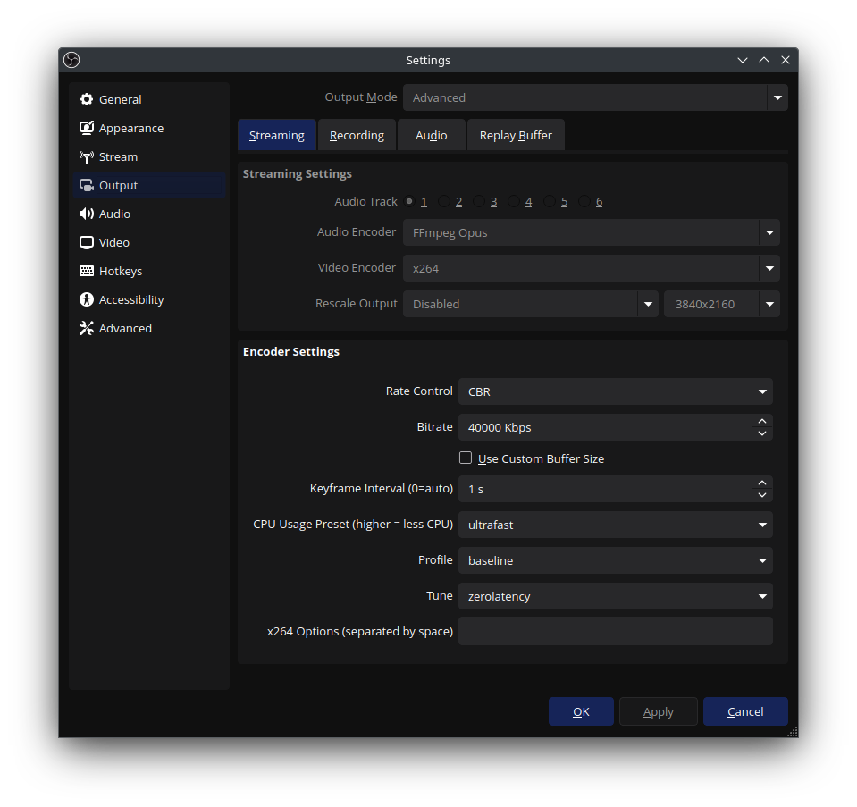

# Web Remote Desktop XR

A proof of concept for a WebXR remote desktop environment utilizing WebRTC (with WHIP) and WebSockets.


## Getting started

This project is primarily created to provide a VR remote desktop environment for Linux environment.

It requires:
- NodeJS
- Docker / podman-compose
- Open Broadcaster Software (OBS)

```bash 
docker compose up -d # starts nginx and OvenMediaEngine
npm start # start the NodeJS backend and frontend server
```

### OvenMediaEngine

OvenMediaEngine will be started as part of the docker-compose services

```bash
docker compose logs -f ome
```

We use [OvenMediaEngine](https://airensoft.gitbook.io/ovenmediaengine/live-source/webrtc)'s WHIP (WebRTC-HTTP Ingestion Protocol) for WebRTC ingest.

This will expose the following endpoints:

- Clear - http://127.0.0.1:10080/app/stream?direction=whip
- TLS - https://127.0.0.1:10081/app/stream?direction=whip

### Broadcasting

This guide uses OBS to capture the Desktop environment and stream it to the WHIP WebRTC ingest endpoint.

#### Dependencies:

- OBS v30 or above
  - [WebRTC (WHIP) output support](https://github.com/obsproject/obs-studio/pull/7926#event-10054225384) (>= v30)
  - [obs-websocket](https://github.com/obsproject/obs-websocket) (>= v28)

#### Sources

You can configure any source you want here.

For remote desktop experience:
1. Configure a Screen Capture source.
2. Select the source, right click and choose: "Resize output (source size)"

Output size is currently limited to 4096x4096 due to the usage of H264 encoder. AV1 and H265 is likely unsupported when used with OvenMediaEngine WebRTC ingest.

#### Broadcast settings

> Reference:
> - [OvenMediaEngine > Quick Start > publishing](https://airensoft.gitbook.io/ovenmediaengine/quick-start#publishing)
> - [OvenMediaEngine > Live Source > WebRTC > WHIP URL](https://airensoft.gitbook.io/ovenmediaengine/live-source/webrtc#whip-url)

Open `Settings` > `Stream`:
- Select service: WHIP
- Server: http://127.0.0.1:10082/app/stream?direction=whip
- Bearer Token: leave blank


Configure your audio / video and video encoding as followed:



The following encoder are tested working on Arch Linux on Wayland with a NVIDIA RTX graphic card:
- x264 (CPU)
- NVIDIA NVENC H.264 (GPU)

#### CPU Encoding
Sample encoder settings
- Video Encoder: x264
- Encoder Settings:
  - Keyframe Interval: 1s
  - CPU Usage Preset: ultrafast
  - Profile: baseline / high
  - Tune: zerolatency

#### GPU Encoding

Sample encoder settings for NVIDIA graphic card
- Video Encoder: NVIDIA NVENC H.264
- Encoder Settings:
  - Keyframe Interval: 1s
  - Preset: P1: Fastest (Lowest Quality)
  - Tuning: Ultra Low Latency
  - Profile: baseline / high

### Start Streaming

1. Confirm / Apply the settings,
2. "Start Streaming"

### Additianal reading for OME:
- Access Control using Signed Policy - https://airensoft.gitbook.io/ovenmediaengine/access-control/signedpolicy


### OBS WebSocket Integration

```ini
WRDXR_OBS_WEBSOCKET=http://localhost:4455
WRDXR_OBS_WEBSOCKET_PASSWORD=check-your-obs-setting
```

## Usage

### Standalone Headset

#### ⚠️ Note - Secure Context (HTTPS)

Usage of [WebXR Device API](https://developer.mozilla.org/en-US/docs/Web/API/WebXR_Device_API) outside of localhost requires a [secure context](https://developer.mozilla.org/en-US/docs/Web/Security/Secure_Contexts).  
If you are loading this onto a standalone headset such as Oculus Quest, you will to:
- Option 1: provision SSL certs for the NodeJS frontend client and for the OvenMediaEngine
- Option 2: provide a local DNS server that resolve your application IP address to a `*.localhost` URL.

The guide below shows usage example using option 1.

##### Option 1:

This project generate a self-signed TLS certificate when you run `docker-compose up -d`

The following ports are running in secure protocols:

| Type | URL |
| -- | -- |
| Frontend        | https://127.0.0.1:10081
| OvenMediaEngine | https://127.0.0.1:10083
| OBS WebSocket   | https://127.0.0.1:10085

Assuming both client and server are on the same network:
- server: 192.168.1.234 (This server)
- client: 192.168.1.100 (Your VR standalone headset)

You can find out your server ip using `ip a | grep "inet "`

Your SSL endpoints should look like this:
- Frontend - `https://192.168.1.234:10081`
- OvenMediaEngine - `wss://192.168.1.234:10083/app/stream`

You may create a `.env.local` with the following content:

```ini
VITE_WRDXR_DEFAULT_FILE=wss://192.168.1.234:10083/app/stream
```

On your standalone headset, open a WebXR capable web browser and go to:  
https://192.168.1.234:10081/?file=wss://192.168.1.234:10083/app/stream

Accept the warning about the SSL self-signed certificate

You should see your broadcasted source on the video player.

Click "Open VR" to enter VR mode.

[See video preview](https://github.com/user-attachments/assets/6268ff89-c110-4342-bff3-b1fc075d6927)

### PC VR

Using a WebXR capable browser, browse to:
- https://127.0.0.1:10081?file=wss://127.0.0.1:10083/app/stream

You should see your broadcasted source on the video player.

Click "Open VR" to enter VR mode.

